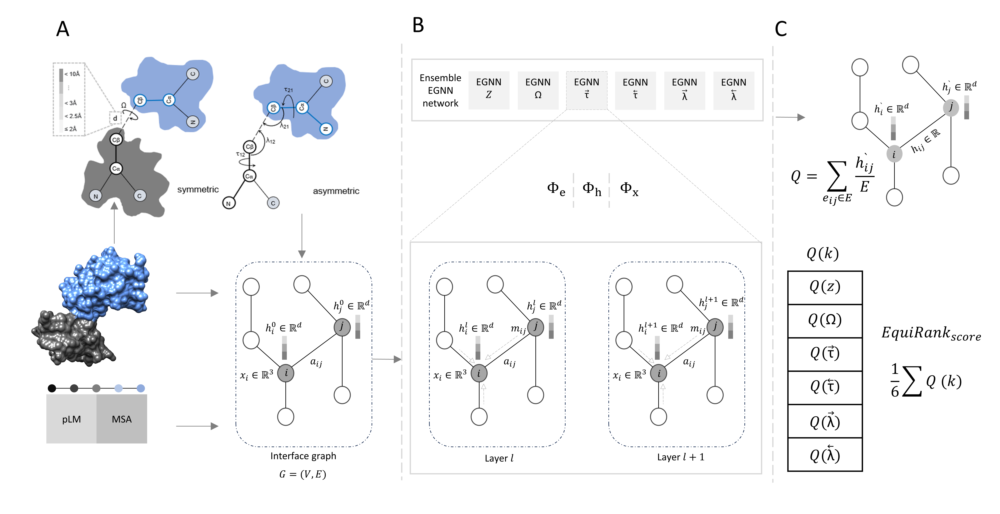

# EquiRank: improved protein-protein interface quality estimation with protein-language-model-informed Equivariant Graph Neural Network (EGNN)

by Md Hossain Shuvo, Debswapna Bhattacharya

Codebase for our protein-protein interface quality estimation by EGNN, PIQLE.



### Environment
PIQLE is tested on x86_64 Linux system in the following Python environment<br/>
1. python 3.6.13 <br/>
2. dgl 0.9.0 <br/>
3. torch 1.10.2 <br/>

### Download and installation
```
$ git clone https://github.com/mhshuvo1/EquiRank.git
$ cd EquiRank
$ python config.py
```
### Usage
To see usage instructions, run
```
$ python EquiRank.py
```
You should see the following output
```
usage: EquiRank.py [-h] [--tgt TARGETNAME] [--seq FASTAFILE] [--dec DECOYDIR]
                   [--ch CHAINFILE] [--msa1 INMSA1] [--msa2 INMSA2]
                   [--a3m1 INA3M1] [--a3m2 INA3M2] [--collabmsa1 INCOLAB1]
                   [--collabmsa2 INCOLAB2] [--esm2emb1 INESM1]
                   [--esm2emb2 INESM2] [--out OUTDIR]

Arguments:
  -h, --help            show this help message and exit
  --tgt TARGETNAME      Target name
  --seq FASTAFILE       Fasta file
  --dec DECOYDIR        Complex decoy directory
  --ch CHAINFILE        Chain file
  --msa1 INMSA1         MSA1: Multiple Sequence Alignment of chain 1
  --msa2 INMSA2         MSA2: Multiple Sequence Alignment of chain 2
  --a3m1 INA3M1         A3M of chain1
  --a3m2 INA3M2         A3M of chain2
  --collabmsa1 INCOLAB1
                        ColabFold distilled MSA of chain1
  --collabmsa2 INCOLAB2
                        ColabFold distilled MSA of chain2
  --esm2emb1 INESM1     ESM2 embeddings of chain1
  --esm2emb2 INESM2     ESM2 embeddings of chain2
  --out OUTDIR          Output directory.
```
<b>Example commands to run PIQLE</b><br/>
```
python PIQLE.py --tgt example --seq absolute_path/example/example.fasta --dec absolute_path/example/decoys/ --ch absolute_path/example/example.chain --msa1 absolute_path/example/msa/example_A.aln --msa2 absolute_path/example/msa/example_B.aln --a3m1 absolute_path/example/msa/example_A.a3m --a3m2 absolute_path/example/msa/example_B.a3m --out absolute_path/example_out/
```
Please see the output ```example/example.EquiRank``` of the above example command.<br/><br/>
<b>Argument descriptions</b><br/><br/>
<b>IMPORTANT:</b> Please provide the absolute paths for all the input files including the output directory<br/>
* --tgt TARGETNAME: name of the target without any extension <br/>
* --seq FASTAFILE: fasta file containing both of the sequences of the complex. Should be exactly in the same order as the chain order in the PDB. Please see ```example/example.fasta``` <br/>
* --dec DECOYDIR: directory containing ONLY complex pdb files. Please see ```example/decoys``` <br/>
* --ch CHAINFILE: chain identifier of the complex. Only one line with chain ids seperated by space. Should be exactly in the same order as the chain order in the PDB. Please see ```example/example.chain``` <br/>
* --msa1 INMSA1: multiple sequence alignment (e.g. '.aln file') of the first chain in the complex. Please see ```example/msa/example_A.aln``` <br/>
* --msa2 INMSA2: multiple sequence alignment (e.g. '.aln file') of the second chain in the complex. Please see ```example/msa/example_B.aln``` <br/>
* --a3m1 INA3M1: A3M of chain1 (e.g. '.a3m file') of the first chain in the complex. Please see ```example/msa/example_A.a3m``` <br/>
* --a3m2 INA3M2: A3M of chain2 (e.g. '.a3m file') of the second chain in the complex. Please see ```example/msa/example_B.a3m``` <br/>
* --out OUTDIR: output directory. IMPORTANT: an output directory will be created, if it does not already exist.

